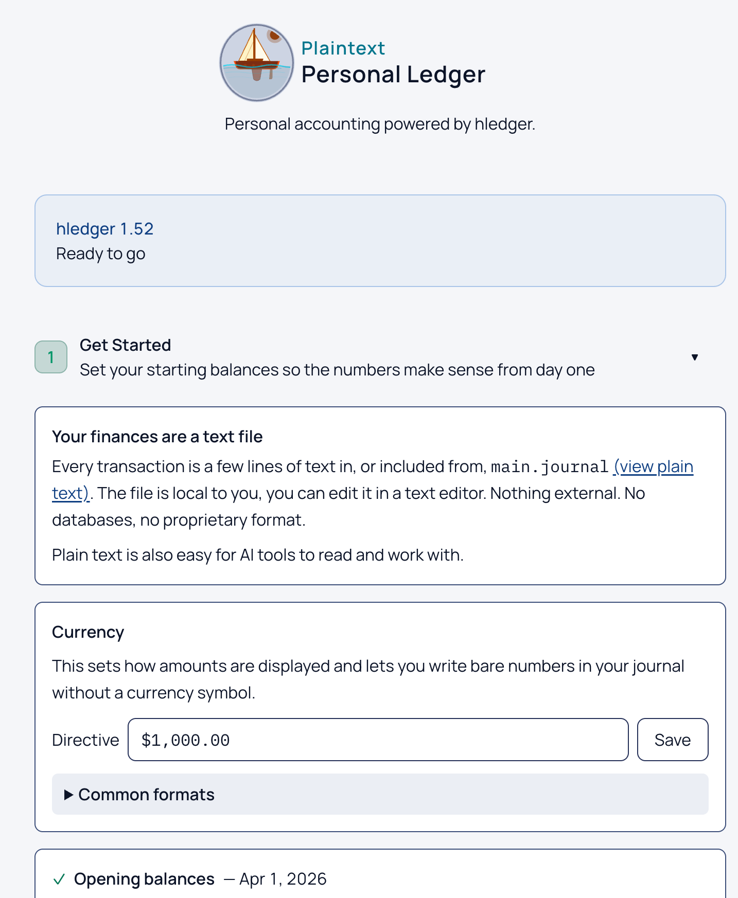

# PlainText Personal Ledger

A web dashboard for [hledger](https://hledger.org/) personal finance. Built on the plain-text journal — hledger stays the source of truth, the UI makes it usable.



## Stack

| Layer      | Choice                                                         |
| ---------- | -------------------------------------------------------------- |
| Framework  | SvelteKit 2 (node adapter)                                     |
| Styling    | Tailwind CSS v4                                                |
| Charts     | Chart.js                                                       |
| Components | bits-ui, dnd-kit-svelte                                        |
| Real-time  | Server-Sent Events + chokidar (auto-refresh on journal change) |
| Data       | Shell out to hledger CLI + in-memory cache                     |

## Features

- **Dashboard** — net worth, MTD income/expenses, savings rate, expense breakdown, recent transactions
- **Register** — searchable transaction list with card and table views
- **Accounts** — account tree grouped by type with balances
- **Balance Sheet** — assets vs liabilities, net worth trend chart
- **P&L** — monthly income/expense breakdown, 3/6/12mo switcher
- **Cash Flow** — money in and out of accounts
- **Budget** — spending targets vs actuals
- **Portfolio** — investment accounts with market values
- **Vendors** — spending by vendor with multi-month trends and sparklines
- **Forecast** — future balance projections from recurring rules
- **Reconcile** — match transactions against bank statements
- **Triage** — review and categorize uncategorized transactions
- **Documents** — statement management, CSV import with preview, invoice tracking with bill/payment linking
- **Import Mappings** — visual `.rules` file editor with drag-and-drop reorder
- **Git History** — journal diff viewer
- **Journal Check** — validation errors with sidebar health indicator
- **Add/Edit Transactions** — forms with auto-balance, drag-and-drop posting reorder, account autocomplete
- **Learning Mode** — beginner/advanced toggle with contextual tooltips, guided tours, and accounting glossary
- **Settings** — drag-and-drop sidebar customization, display preferences
- **Keyboard Shortcuts** — `g d` dashboard, `g r` register, `g v` vendors, `n` new transaction, `/` search, `?` help

## Auto-refresh

The server watches journal files for changes. Any open browser tab refreshes automatically via Server-Sent Events.

## Prerequisites

[hledger](https://hledger.org/) and a Node package manager (this project uses pnpm).

```bash
brew install hledger
brew install pnpm
```

[Other installation options →](https://hledger.org/install.html#packaged-binaries)

## Running

Development (with hot reload):

```bash
pnpm install
pnpm dev
```
